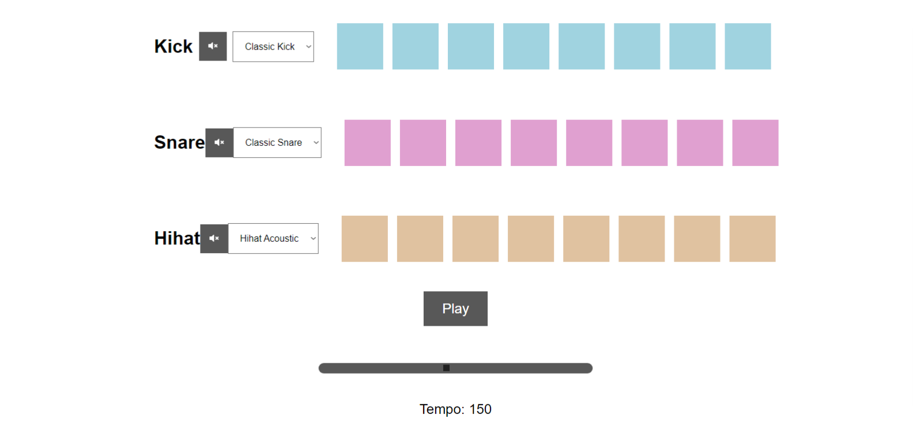

# BeatMaker
Finished beatmaker using HTML,CSS and vanilla JS. First time build using tutorials, second time built by myself using my notes and occasional glance to tutorials. 
I have really enjoyed working on this and make it play sounds. There were a couple of parts that were unclear with updateBtn and uses of this., but eventually I figured it out.
What I have learned:Classes,constructors,this. and objects,methods,loops,callback functions,call stack,global execution context,prototypes etc.

